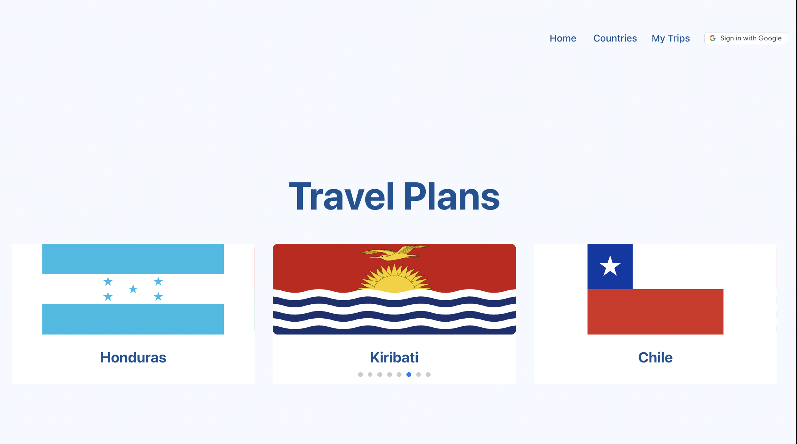
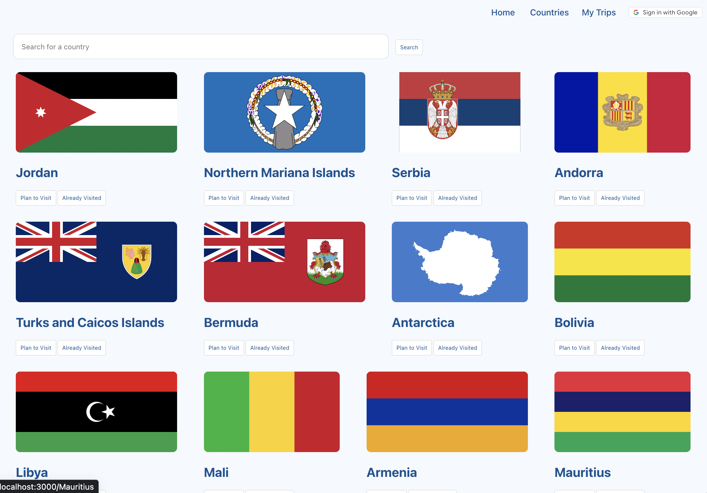
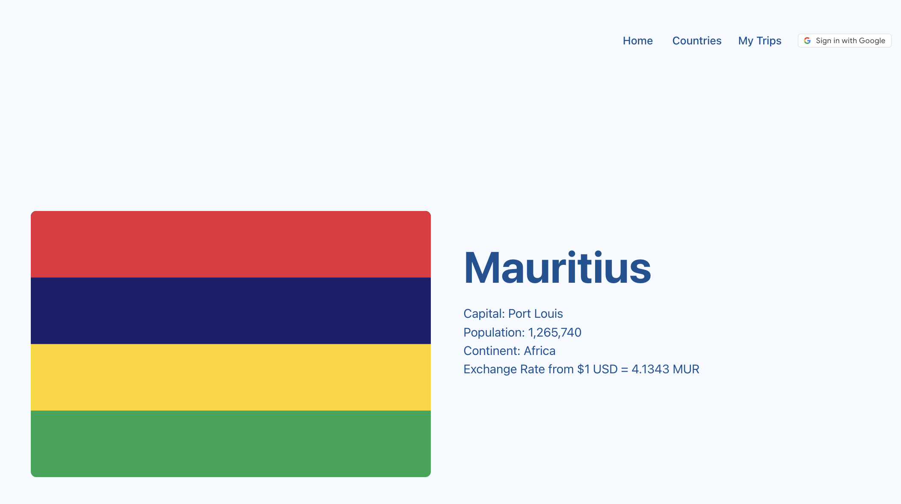
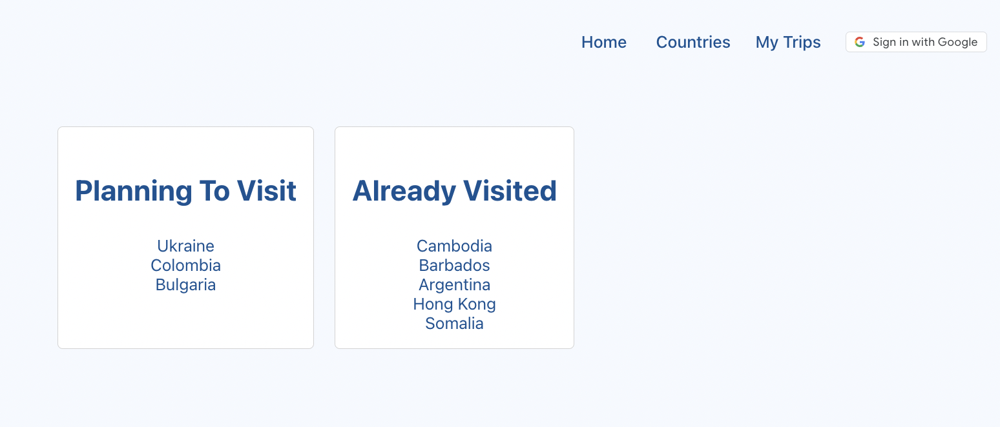

# Travel Plans
Travel Plans is an organizing app, where users can view a list of every country in the world, view details of a selected country, including a currency exchange rate, and add countries to a "plan to visit" list or an "already visited" list. It is created to help world travelers plan and keep track of their adventures!

<!-- [View Project on Netlify](netlify link) -->

<hr style='border: 3px solid black'>

### Table of Contents

- [Technolgies Used](#technologies-used)
- [Getting Started/Installation](#getting-started)
- [Coding Challenges](#coding-challenges)
- [Next Steps](#next-steps)
- [Contributions](#contributions)

<hr style='border: 3px solid black'>

## Site Preview





## Technologies Used
- Javascript
- ReactJS Framework
- HTML
- CSS
- Trello and InVision for project planning
- Netlify for app deployment

## Getting Started / Installation
    Planning materials: https://trello.com/b/h95Cw5W5/capstone-project-4

    1. Fork repo from GitHub
    2. Clone into code editor
    3. Install all necessary dependencies with:
        ```
        npm i
        ````
    4. To run the app in development mode:
        ```
        npm start
        ````

## Coding Challenges
The most challenging aspect of this project was learning how to access, parse, and render information from two third-party API's.

## Next Steps
- To add a backend so a user's plans can be saved to a database, and accessed every time they log in.

## Contributions
Front-end development: Nia Salgado<br/>
Please feel free to message me on Slack for any questions, suggestions, bug id's, and/or contributions! @Nia Salgado

## Acknowledgments
- Implement Google OAuth: https://www.youtube.com/watch?v=HtJKUQXmtok
- Flexbox styling tips: https://css-tricks.com/snippets/css/a-guide-to-flexbox/
- React component carousel: https://swiperjs.com/demos#slides-per-view
- Adobe SEI'23 Instructional Team 


## Available Scripts
In the project directory, you can run:

### `npm start`

Runs the app in the development mode.\
Open [http://localhost:3000](http://localhost:3000) to view it in your browser.

The page will reload when you make changes.\
You may also see any lint errors in the console.

### `npm test`

Launches the test runner in the interactive watch mode.\
See the section about [running tests](https://facebook.github.io/create-react-app/docs/running-tests) for more information.

### `npm run build`

Builds the app for production to the `build` folder.\
It correctly bundles React in production mode and optimizes the build for the best performance.

The build is minified and the filenames include the hashes.\
Your app is ready to be deployed!

See the section about [deployment](https://facebook.github.io/create-react-app/docs/deployment) for more information.

### `npm run eject`

**Note: this is a one-way operation. Once you `eject`, you can't go back!**

If you aren't satisfied with the build tool and configuration choices, you can `eject` at any time. This command will remove the single build dependency from your project.

Instead, it will copy all the configuration files and the transitive dependencies (webpack, Babel, ESLint, etc) right into your project so you have full control over them. All of the commands except `eject` will still work, but they will point to the copied scripts so you can tweak them. At this point you're on your own.

You don't have to ever use `eject`. The curated feature set is suitable for small and middle deployments, and you shouldn't feel obligated to use this feature. However we understand that this tool wouldn't be useful if you couldn't customize it when you are ready for it.